Seminar Report
=======

Introduction
------------

Suppose that you are shown a picture of a bird, which you have not seen before in your life. Your brain immediately understands that the 
object in the picture is a bird, therefore all the previous knowledge you have gathered through past experiences regarding <em>birds</em> 
in general are attached to the bird image that you have just seen. Only by seeing a single image, you can guess the size of the bird, 
how would the bird looks like from other angles and whether the feathers on the back of the bird look similar to those you see on the image.

This paper is tackling the same problem, which is learning a predictor which predicts 3D shape, camera pose and the mesh texture at the same time, given a single image in inference time. The training data only consists of annotated 2D image collection.

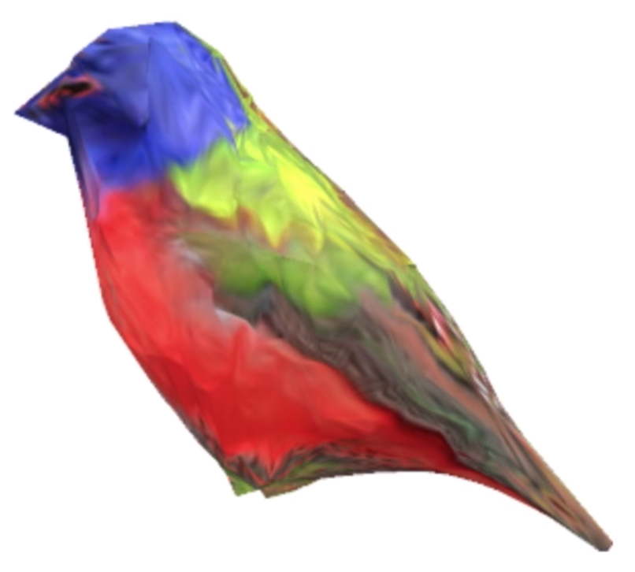

The problem of 3D reconstruction from a single image is ill-posed[1]. If we had multiple images of the same object, then we could exploit multiple-view geometry techniques, such as formulating the problem as a convex variatonal method. However, in this paper, we are only able to reconstruct 3D shape because the predictor already knows the mean shape of a bird in inference time.

Related Work
----------------
Prior works tackled inferring 3D shape problem with different perspectives. First group of methods tried to learn deformable models using 3D ground truth data.[2][3] The drawback of these methods are that obtaining 3D ground truth data is hard and/or expensive. Especially in cases like using animals as objects, like in CUB-200-2011 dataset[4], 2D annotated image collection is easier to obtain than 3D scans. Therefore, those methods are fundamentally different than this paper, which only requires 2D annotated image collection as the training data.

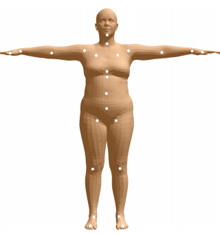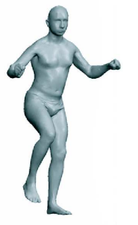

Second group of related works use only 2D annotated image collection as training data, similar to this paper. However, these methods require annotations also in test time. For instance, [5] aims to infer 3D shapes of dolphins using 2D images. That method uses keypoints correspondences and segmentation masks in the training time and segmentation masks during test time. The reason behind requiring annotations during test time is that these methods use fitting-based inference, therefore they minimize some kind of loss function during inference time. Our paper, however, is a prediction-based inference model, which directly predicts the 3D shape given the input image.

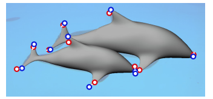

Third group of related works employ different 3D shape representations than deformable meshes. There are a number of possible representations for 3D shape, such as voxels, point cloud or octree. These methods generally require a stronger supervision, such as 3D ground truth data or images from multiple-views. Moreover, the choice of deformable meshes come with several advantages; associating semantic keypoints with mesh vertices and inferring mesh texture as an RGB image in a canonical appearance space.[1]

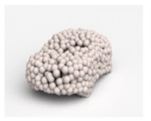Representing 3D shape with point cloud[6]

To summarize, this paper differs from related work primarily in 3 aspects:
* Deformable model representation and directly inferring 3D shape
* Learning from only 2D image collection
* Ability to infer texture

Methodology
------------
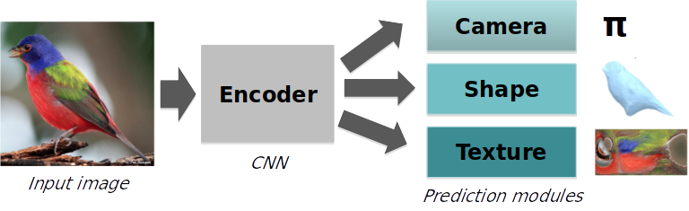
The aim of the paper is to learn a predictor which is capable of inferring the full 3D representation of an object, given a single 2D unannotated image. The full 3D representation consists of 3D shape, which is parametrized as deformable mesh, camera pose and texture. In order to achieve this, a 2-stage architecture has been used. In the first stage, the input image is fed to an encoder module. The encoder is a convolutional neural network (CNN) whose structure is ResNet-18 model followed by a convolutional layer and two fully-connected layers. Encoder module takes the input image and represents it in a shared latent space of size 200, which is then used by the modules in the second stage.
     
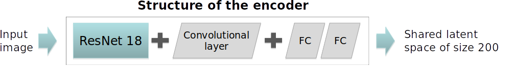

In the second stage of the architecture, the latent representation is shared across 3 prediction modules, namely shape prediction, camera pose prediction and texture prediction. The details of those prediction modules and design decisions will be discussed below, however it is important to know the internal architecture of these modules. Shape prediction and camera prediction modules are just linear layers and texture flow module consists of 5 upconvolution layers.

The main dataset used in this paper is CUB-200-2011, which has 6000 training and and test images if 200 species of birds.[1][4] Every image in the dataset is annotated with bounding box, visibility indicator, locations of semantic keypoints (can be imagined as the tail, the head etc.) and segmentation masks. The authors filtered out 5% of the data whose semantic keypoints are mostly non-visible.

The annotations used to supervise the learning process are semantic keypoint locations and segmentation masks. Learning process involves minimizing the weighted sum of a number of loss functions, regarding 3 prediction modules and some priors that will be explained later in this post.

### Camera Pose Prediction

Camera projection in the paper is represented with weak-perspective projection. The simplifying assumption of the weak-perspective projection is that the depth values of all pixels across all images are the same and equal to a constant value. By making this assumption, we are able to predict the scale of the objects in the images.

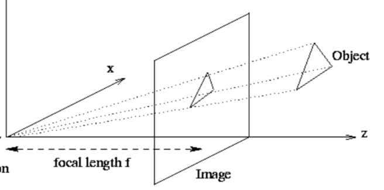

In camera pose prediction module, our aim is to predict the scale of the object, as well as translation and rotation of the camera. With these parameters, we are able to project a given 3D point onto the image coordinates. Estimating camera is particularly important, since we only have 2D ground truth data and the only way to compare our predicted 3D shape with ground truth is projecting the 3D shape onto the image.

Since the training data only contains semantic keypoints and segmentation mask annotations, but not camera-related annotations, the authors use an algorithm called **structure-from-motion** in order to obtain camera pose estimates. When applied to the semantic keypoints, the structure-from-motion algorithm is able to obtain accurate camera pose estimates. These estimates are used to augment the training data and served as the ground truth for the learning process of camera pose.

During training, the camera estimate is trained so that the difference between the camera estimate and structure-from-motion camera is minimized. 

### Shape Prediction

Arguably, the most important prediction module of this paper is shape prediction. The reason is that 3D shape is the most informative component of full 3D representation and the learning process involves both of the annotations. The paper represents 3D shapes are **deformable meshes**, which can be expressed as M=(V,F) where V is the vertices of the mesh and F is the faces. 3D shape of an instance is calculated as combining the mean shape for the class and the instance-specific deformation from the mean shape.

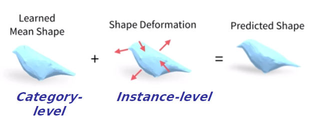

The mean shape is a category-level (for the CUB-200-2011 dataset, the category is <em>birds</em>) structure, which is learned by the predictor during training time. The naive way to initialize the mean shape is setting it to a sphere, however the authors mentioned that a smarter initizalization gives better results. First, mean keypoint locations are obtained using structure-from-motion applied to the annotated keypoints in input data. Then, the convex hull of these keypoint locations are calculated. Finally, every vertex of the initial mean shape are projected onto this convex hull. This approach already gives the mean shape a reasonable starting point, with the semanctic keypoint locations being considered.

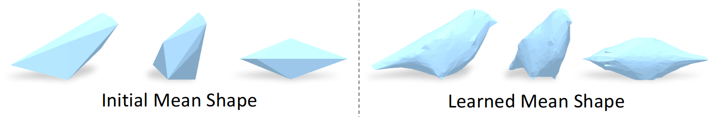

During training, the predictor updates the mean shape by minimizing the loss functions as well as learns a deformation space. By learning a deformation space, the predictor then is able to infer the instance-level deformation from the mean shape given a single image in test time. There are 2 loss functions which are used in the learning process of shape prediction:
* Keypoint projection loss
* Segmentation mask loss

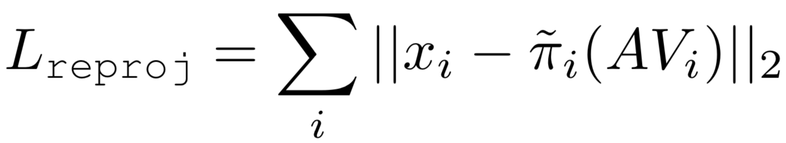

Keypoints are the crutial annotations that are used in the training process, since they provide category-specific semantic information. Since we represent the shape using a category-level mean mesh, we explitly learn to associate those semantic keypoints with the vertices of the mean shape. We use a **keypoint assignment matrix** A to specify correspondences between the vertices of the mean shape and keypoints. Every row of the keypoint assignment matrix A represents a probability distribution over all vertices, indicating the probabilities of correspondence with a specific keypoint. These probability distributions, which are initialized as the uniform distribution, are updated during the training. We also encourage that the final probability distributions are peaked distrbutions. This representation allows us to locate semantic keypoints in any predicted shape. More specifically, given the vertex positions V, the locations of the semantic keypoints can be obtained by A*V.

Keypoint projection loss ensures that the semantic keypoint locations in the predicted 3D structure, when projected to 2D image using structure-from-motion camera parameters, is consistent with the ground truth semantic keypoint locations. This can be considered as the main loss function which enables us to have good predicted 3D shapes. The semantic keypoints in the training data gives semantic information about the objects (i.e. birds) in the images. Therefore, by restricting our predicted shape to have consistent semantic keypoint locations, we make sure that our predicted shape has the same semantic properties of a bird.

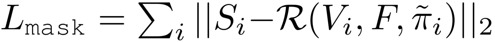

The second loss function of the shape prediction module is the segmentation mask loss. It enforces that the predicted 3D mesh is consistent with the grount truth segmentation mask. Here, a renderer is needed since we need to compare segmentation masks in 2D. The authors use **Neural Mesh Renderer**[7] for this purpose. For a more detailed discussion about Neural Mesh Renderer, readers can see the blog post for that paper. 

Intuitively, the mask loss makes sure that our predicted shape is consistent with the ground truth segmentation masks in the dataset. Even though the keypoint loss ensures we capture the semantic keypoints, mask loss is still helpful in order to fine-tune our prediction (e.g. we can imagine that it makes our predicted bird a fatter/thinner)

Inferring 3D shape from a single image brings some assumptions about the symmetry of the objects. Since there is only one image of an object available, we assume that the other half of the object is actually symmetric. For this reason, only one of the symmetric vertex pairs are learned/predicted.

### Texture Prediction

This paper, unlike the prior works, predicts texture of the 3D shapes as well. The choice of representing 3D shape with deformable mesh becomes useful in texture prediction module. Let's recall that every 3D shape of an instance is equivalent to some kind of deformation applied to the mean shape. Moreover, the mean shape is **isomorphic** to a sphere, meaning that they have corresponding shapes. This property of the mean shape allows us to represent its texture using a texture image with fixed **UV-mapping**.

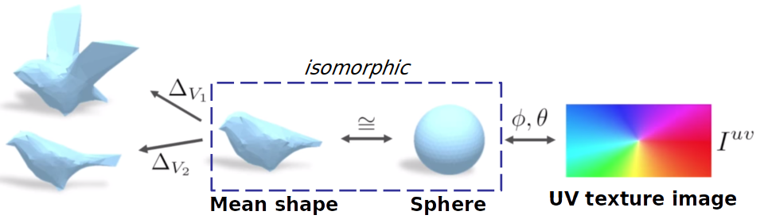

Inferring the texture of the 3D shapes is equivalent of inferring the pixel values of the corresponding texture image. Once we predict the texture image, we can apply UV-mapping to roll texture image onto the sphere. Then, we can apply apply texture to the mean image, since the mean image and the sphere are isomorphic. Finally, we can move from the mean image to the instance-specific 3D shape since we already know how every vertex of the mean shape should be deformed in order to get the instance-specific 3D shape.

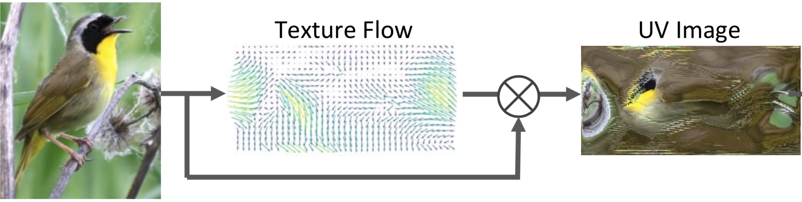

Inferring pixel values of the texture image can be viewed from two perspectives. One approach would be directly predicting the pixel values by looking at the input image. This approach often results in blurry images.[1] The second approach is to predict the **texture flow**, which serves as a mapping between the input image pixels to the texture image pixels. Appearance flow tells where to copy the original pixel values, in the texture image. The obvious advantage of this method is it does not cause blurry texture images.

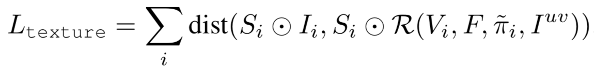

Texture loss function is used in the learning process of texture prediction. Texture loss ensures that the texture of the object in ground truth data is consistent with the texture of the predicted 3D shape, when rendered onto the 2D image. Texture is predicted on top the predicted shape, therefore the gradients of the texture loss function are calculated until the predicted texture, but not until the predicted shape. In other words, texture loss does not influence predicted shape.

Symmetry is also assumed in texture prediction, similar to the shape parametrization. In shape prediction, only one of the symmetric vertex positions are predicted. In texture prediction, symmetric faces are assigned to the same pixel values in the texture image.

### Priors

In addition to the loss functions of the 3 prediction modules, 3 prior terms are used to encourage additional properties. These are namely smoothness, deformation regularization and keypoint association.

* **Smoothness** prior term encourages that the surfaces of the predicted 3D shape to be smooth. Following the prior work in Computer Graphics commmunity, authors used minimization of the mean curvature to represent smoothness.[8][9]
* **Deformation regularization** prior term prevents instance-level deformations to be arbitrarily large.
* **Keypoint association** prior term encourages that the probability distrubution in every row of the keypoint association matrix A to be a peaked distribution. It is formulated as minimizing the average entropy over all keypoints.

Results
----------
This paper tackles the 3D mesh reconstruction problem by using only 2D input data. Most of the works that have been done in this field require more supervision than this method. Therefore, the results which authors showed in the paper focus more on the qualitative side. Similarly, the choice of the dataset (birds images) suggests that the emphasis to be explaning how this method can make inferring full 3D representation by using only 2D images possible, rather than showing extensive quantitative results.

### Qualitative Results
The authors present randomly selected reconstruction results at the end of the paper. We can see that the method is able to capture the general shape and texture of the objects in the input image. Since the camera pose is also predicted, reconstructed shapes are shown from different angles as well.

Random results also show that the method is able to capture different poses of the birds, such as flying position or different orientations of the wings.

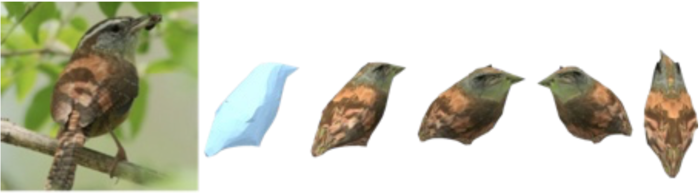
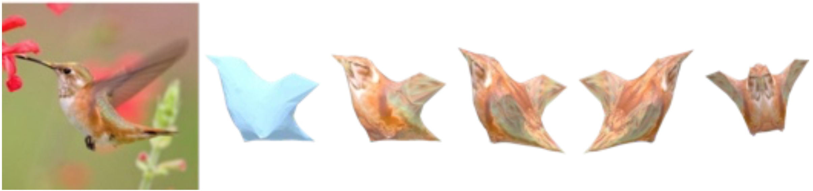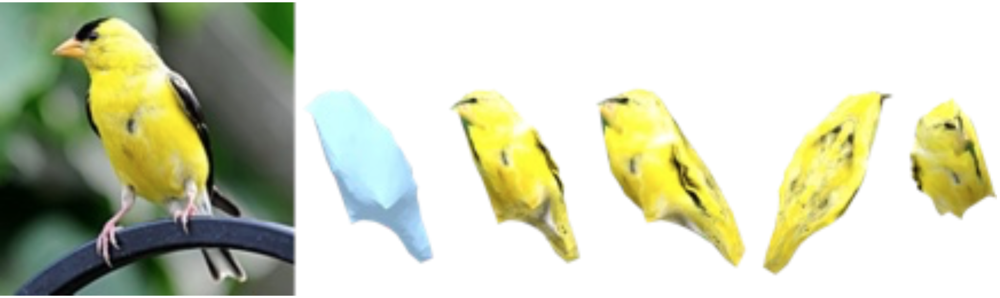

On the other hand, one can see that the reconstructed shapes do not strongly differ from each other for the most of the instances, therefore the constructions are less accurate for the birds which are more different from the other birds. This suggests that the method's capability of learning instance-specific deformations are limited. This is indeed logical, since there is only one image of the same bird in the inference time.

#### Learned deformation modes
As mentioned earlier, the method learns a category-level mean shape, as well as a deformation space so that it is able to predict the instance-level deformation in test time. The authors included an analysis of this learned deformation space by showing the common modes of deformation in the whole training dataset. This is obtained by applying Principal Component Analysis (PCA) to the latent deformation space. Thus, some of the most typical deformations in the training dataset are visualized as follows: 

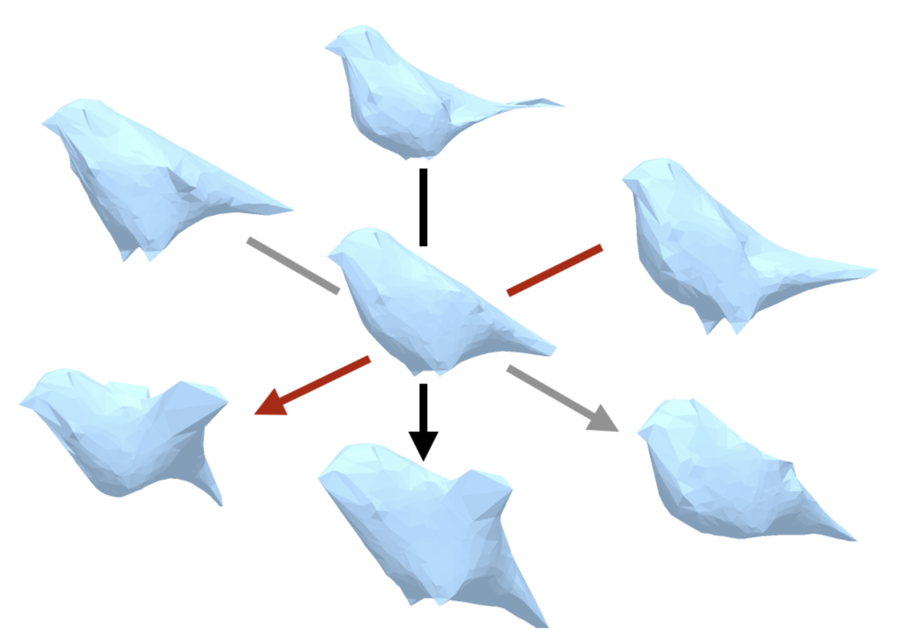

Common modes of deformation show the opening wings, thin or fat birds and several deformations of the tail and legs.[1] Qualitatively, this serves as a supporting argument for the method being able to capture meaningful deformations.

### Quantitative Results

References
------------
[1] Kanazawa, Angjoo, et al. "Learning category-specific mesh reconstruction from image collections." Proceedings of the European Conference on Computer Vision (ECCV). 2018.  
[2] Loper, Matthew, et al. "SMPL: A skinned multi-person linear model." ACM transactions on graphics (TOG) 34.6 (2015): 248.  
[3] Anguelov, Dragomir, et al. "SCAPE: shape completion and animation of people." ACM transactions on graphics (TOG). Vol. 24. No. 3. ACM, 2005.  
[4] Wah, Catherine, et al. "The caltech-ucsd birds-200-2011 dataset." (2011).  
[5] Cashman, Thomas J., and Andrew W. Fitzgibbon. "What shape are dolphins? building 3d morphable models from 2d images." IEEE transactions on pattern analysis and machine intelligence 35.1 (2012): 232-244.  
[6] Fan, Haoqiang, Hao Su, and Leonidas J. Guibas. "A point set generation network for 3d object reconstruction from a single image." Proceedings of the IEEE conference on computer vision and pattern recognition. 2017.  
[7] Kato, Hiroharu, Yoshitaka Ushiku, and Tatsuya Harada. "Neural 3d mesh renderer." Proceedings of the IEEE Conference on Computer Vision and Pattern Recognition. 2018.  
[8] Pinkall, Ulrich, and Konrad Polthier. "Computing discrete minimal surfaces and their conjugates." Experimental mathematics 2.1 (1993): 15-36.  
[9] Sorkine, Olga, et al. "Laplacian surface editing." Proceedings of the 2004 Eurographics/ACM SIGGRAPH symposium on Geometry processing. ACM, 2004.  
